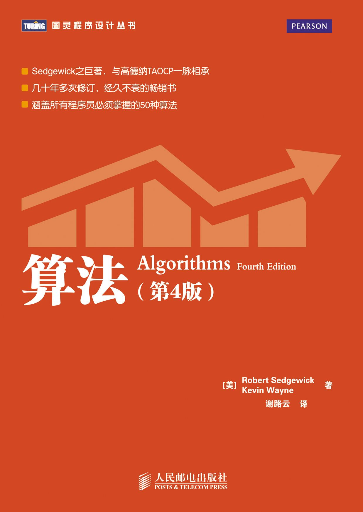

# Algorithms in Golang

### 学习算法的最好机会是十年前，其次是现在。

## 目录
- [1.基础](./1.Fundamentals)
    - [1.1.基础编程模型](./1.Fundamentals/1.1.BasicProgrammingModel)
    - [1.2.数据抽象](./1.Fundamentals/1.2.DataAbstraction)
    - [1.3.背包、队列和栈](./1.Fundamentals/1.3.BagsQueuesAndStacks)
    - [1.4.算法分析](./1.Fundamentals/1.4.AnalysisOfAlgorithms)
    - [1.5.案例研究：union-find算法](./1.Fundamentals/1.5.CaseStudy-Union-Find)
- [2.排序](./2.Sorting)
    - [2.1.初级排序算法](./2.Sorting/2.1.ElementarySorts)
    - [2.2.归并排序](./2.Sorting/2.2.Mergesort)
    - [2.3.快速排序](./2.Sorting/2.3.QuickSort)
    - [2.4.优先队列](./2.Sorting/2.4.PriorityQueues)
    - [2.5.应用](./2.Sorting/2.5.Applications)
- [3.搜索](./3.Searching)
    - [3.1.符号表](./3.Searching/3.1.SymbolTables)
    - [3.2.二叉查找树](./3.Searching/3.2.BinarySearchTrees)

## 参考资料
1. [算法（第4版）](https://book.douban.com/subject/19952400)
